# 🚀 InsightHub — DevSecOps Business Intelligence Platform

<p align="center">


</p>

<p align="center">
  <strong>A production-style Business Intelligence application with an end-to-end DevSecOps delivery workflow.</strong>
</p>

---

# 📌 Overview

**InsightHub** is a full-stack Business Intelligence and Analytics platform built with a practical **DevSecOps workflow**.

The project combines a modern React frontend, Node.js/Express backend and MySQL database with automated CI/CD, security scanning, code-quality analysis, Kubernetes deployment, GitOps-based delivery and monitoring.

The application provides:

- 🔐 JWT-based authentication
- 📊 Business Intelligence dashboard
- 📈 Analytics and charts
- 👥 Customer information
- 💳 Transaction information
- 📦 Offerings
- ⚙️ Settings
- 📝 Activity information
- 🌐 REST APIs
- 🗄️ MySQL database

The DevSecOps implementation provides:

- 🐳 Docker containerization
- 🔨 Jenkins CI
- 🔎 SonarQube code analysis
- 🚦 SonarQube Quality Gate
- 🛡️ Trivy filesystem scanning
- 🛡️ Trivy Docker image scanning
- 📦 Docker Hub image publishing
- ☸️ Kubernetes deployment
- 🧩 Kustomize configuration management
- 🔍 Kubeconform manifest validation
- 🚀 Argo CD GitOps delivery
- 🤖 Argo CD Image Updater
- 📡 Prometheus monitoring
- 📊 Grafana visualization
- ☁️ AWS EC2 infrastructure

---

# 🎯 Problem Statement

Building an application is only one part of a production deployment.

A real-world application also needs:

- Automated builds
- Code quality checks
- Security scanning
- Containerization
- Reliable deployment
- Configuration management
- Continuous delivery
- Monitoring
- Troubleshooting and observability

This project implements these requirements through an end-to-end DevSecOps workflow.

```text
Developer
    │
    ▼
  GitHub
    │
    ▼
 GitHub Webhook
    │
    ▼
 Jenkins CI
    │
    ├── Checkout
    ├── Install Dependencies
    ├── Trivy Filesystem Scan
    ├── SonarQube Analysis
    ├── Quality Gate
    ├── Docker Build
    ├── Trivy Image Scan
    ├── Kubernetes Validation
    └── Docker Hub Push
              │
              ▼
     Argo CD Image Updater
              │
              ▼
           Argo CD
              │
              ▼
        Kubernetes
              │
              ▼
       InsightHub
              │
              ├── Prometheus
              │
              └── Grafana
```

---

# 🏗️ Architecture

The infrastructure is divided across **two AWS EC2 instances**.


```text
                           ┌───────────────────┐
                           │     Developer     │
                           └─────────┬─────────┘
                                     │
                                     ▼
                           ┌───────────────────┐
                           │      GitHub       │
                           │   insight-hub     │
                           └─────────┬─────────┘
                                     │
                              GitHub Webhook
                                     │
                                     ▼

      ┌─────────────────────────────────────────────────────────┐
      │                  AWS EC2 #1                             │
      │                DevSecOps Server                         │
      │                                                         │
      │  ┌────────────────┐       ┌────────────────────────┐    │
      │  │    Jenkins     │──────▶│       SonarQube        │    │
      │  │      CI        │       │    Code Quality        │    │
      │  └───────┬────────┘       └────────────────────────┘    │
      │          │                                              │
      │          ├── Trivy Filesystem Scan                     │
      │          ├── Docker Build                              │
      │          ├── Trivy Image Scan                          │
      │          └── Kubeconform Validation                    │
      │                                                         │
      └──────────────────────────┬──────────────────────────────┘
                                 │
                                 ▼
                         ┌────────────────┐
                         │   Docker Hub   │
                         │                │
                         │ backend:TAG    │
                         │ frontend:TAG   │
                         └───────┬────────┘
                                 │
                                 ▼

      ┌─────────────────────────────────────────────────────────┐
      │                  AWS EC2 #2                             │
      │               Kubernetes Server                         │
      │                                                         │
      │                 ┌─────────────────┐                     │
      │                 │     Argo CD     │                     │
      │                 │     GitOps      │                     │
      │                 └────────┬────────┘                     │
      │                          │                              │
      │                 ┌────────▼─────────┐                    │
      │                 │ Argo CD Image    │                    │
      │                 │    Updater       │                    │
      │                 └────────┬─────────┘                    │
      │                          │                              │
      │                          ▼                              │
      │          ┌────────────────────────────────┐             │
      │          │       Kubernetes Cluster       │             │
      │          │                                │             │
      │          │  ┌─────────────────────────┐   │             │
      │          │  │ React + Nginx Frontend  │   │             │
      │          │  └────────────┬────────────┘   │             │
      │          │               │                │             │
      │          │  ┌────────────▼────────────┐   │             │
      │          │  │ Node.js + Express       │   │             │
      │          │  │ Backend                 │   │             │
      │          │  └────────────┬────────────┘   │             │
      │          │               │                │             │
      │          │  ┌────────────▼────────────┐   │             │
      │          │  │ MySQL 8 + Persistent    │   │             │
      │          │  │ Storage                 │   │             │
      │          │  └─────────────────────────┘   │             │
      │          │                                │             │
      │          │       Prometheus               │             │
      │          │            │                   │             │
      │          │            ▼                   │             │
      │          │         Grafana                │             │
      │          └────────────────────────────────┘             │
      │                                                         │
      └─────────────────────────────────────────────────────────┘

                    AWS Security Groups
```

> 📌 **Architecture image location:** `docs/images/architecture.png`

---

# ✨ Features

## 💻 Application Features

- 🔐 JWT Authentication
- 🛡️ Protected Routes
- 📊 Business Intelligence Dashboard
- 📌 KPI Cards
- 📈 Analytics Dashboard
- 👥 Customer Information
- 💳 Transaction Information
- 📦 Offerings Management
- ⚙️ Application Settings
- 📝 Activity Information
- 🌐 REST APIs
- 🗄️ MySQL Database
- 📱 Responsive React Interface

---

## ⚙️ DevSecOps Features

- GitHub Webhook
- Jenkins CI Pipeline
- Parallel Dependency Installation
- Trivy Filesystem Scan
- SonarQube Code Analysis
- SonarQube Quality Gate
- Docker Image Build
- Trivy Docker Image Scan
- Kubernetes Manifest Validation
- Docker Hub Push
- Kubernetes Deployment
- Kustomize
- Argo CD
- Argo CD Image Updater
- Prometheus
- Grafana
- AWS EC2
- AWS Security Groups

---

# 🛠️ Tech Stack

| Category | Technologies |
|---|---|
| Frontend | React, Vite, React Router, Axios, Recharts, Lucide React |
| Backend | Node.js, Express.js |
| Database | MySQL 8 |
| Authentication | JWT, bcryptjs |
| Containerization | Docker, Docker Compose |
| Orchestration | Kubernetes |
| Configuration | Kustomize |
| CI | Jenkins |
| Code Quality | SonarQube |
| Security | Trivy |
| Registry | Docker Hub |
| Continuous Delivery | Argo CD |
| Image Automation | Argo CD Image Updater |
| Monitoring | Prometheus, Grafana |
| Cloud | AWS EC2, AWS Security Groups |
| Source Control | Git, GitHub |

---

# ☁️ AWS Infrastructure

## EC2 #1 — DevSecOps Server

The first EC2 instance is dedicated to CI and code-quality tooling.

```text
AWS EC2
   │
   ├── Jenkins
   │
   └── SonarQube
```

### Responsibilities

- Jenkins CI pipeline
- SonarQube analysis
- Quality Gate verification
- Trivy security scanning
- Docker image builds
- Docker Hub publishing
- Kubernetes manifest validation

---

## EC2 #2 — Kubernetes Server

The second EC2 instance hosts application deployment and monitoring.

```text
AWS EC2
   │
   ├── Kubernetes
   ├── Argo CD
   ├── Argo CD Image Updater
   ├── Prometheus
   ├── Grafana
   └── InsightHub
```

### Responsibilities

- Kubernetes workloads
- Application deployment
- GitOps delivery
- Automatic image updates
- Monitoring
- Metrics collection

---

# 🔐 AWS Security Groups

AWS Security Groups are used to control network access to the EC2 infrastructure.

The infrastructure separates:

```text
CI/CD Infrastructure
        │
        ▼
DevSecOps EC2
```

and:

```text
Application Infrastructure
        │
        ▼
Kubernetes EC2
```

Only the required ports are exposed according to the deployment configuration.

---

# 📂 Project Structure

```text
insight-hub/
│
├── client/
│   ├── .dockerignore
│   ├── .env.example
│   ├── .gitignore
│   ├── Dockerfile
│   ├── index.html
│   ├── nginx.conf
│   ├── package.json
│   ├── package-lock.json
│   │
│   └── src/
│       ├── App.jsx
│       ├── main.jsx
│       ├── styles.css
│       │
│       ├── components/
│       │   ├── KpiCard.jsx
│       │   ├── PageHeader.jsx
│       │   └── StatusBadge.jsx
│       │
│       ├── layouts/
│       │   └── AppLayout.jsx
│       │
│       ├── pages/
│       │   ├── Analytics.jsx
│       │   ├── Customers.jsx
│       │   ├── Dashboard.jsx
│       │   ├── Login.jsx
│       │   ├── Offerings.jsx
│       │   ├── Settings.jsx
│       │   └── Transactions.jsx
│       │
│       └── services/
│           └── api.js
│
├── server/
│   ├── .dockerignore
│   ├── .env.example
│   ├── .gitignore
│   ├── Dockerfile
│   ├── package.json
│   ├── package-lock.json
│   │
│   └── src/
│       ├── index.js
│       ├── config/
│       │   └── db.js
│       ├── controllers/
│       │   └── ...
│       ├── database/
│       │   └── init.js
│       ├── middleware/
│       │   └── auth.js
│       ├── routes/
│       │   └── ...
│       └── utils/
│           └── jwt.js
│
├── k8s/
│   ├── backend/
│   │   ├── deployment.yml
│   │   └── service.yml
│   │
│   ├── frontend/
│   │   ├── deployment.yml
│   │   └── service.yml
│   │
│   ├── mysql/
│   │   ├── deployment.yaml
│   │   ├── pvc.yml
│   │   └── service.yml
│   │
│   ├── monitoring/
│   │   └── backend-servicemonitor.yaml
│   │
│   ├── configmap.yml
│   ├── image-updater.yaml
│   ├── ingress.yml
│   ├── kustomization.yaml
│   ├── namespace.yml
│   └── secret.yml
│
├── docs/
│   └── images/
│
├── Jenkinsfile
├── docker-compose.yml
├── sonar-project.properties
├── .gitignore
└── README.md
```

---

# 🔄 Application Workflow

InsightHub follows a frontend → backend → database architecture.

```text
                         User
                           │
                           ▼
                  React + Nginx
                     Frontend
                           │
                     REST API
                           │
                           ▼
                 Node.js + Express
                      Backend
                           │
                     MySQL Query
                           │
                           ▼
                       MySQL 8
                           │
                           ▼
                      Response
                           │
                           ▼
                     React UI
```

---

# 🔐 Authentication Workflow

```text
User
 │
 ▼
Login Page
 │
 │ Email + Password
 ▼
Express Authentication API
 │
 ▼
MySQL
 │
 │ Validate User
 ▼
JWT Token
 │
 ▼
Frontend
 │
 ▼
Protected API Requests
```

Authentication uses **JWT**, while passwords are protected using **bcryptjs**.

---

# 🐳 Docker

The application is containerized into separate frontend and backend images.

```text
                    Docker
                       │
             ┌─────────┴─────────┐
             │                   │
             ▼                   ▼
       Backend Image       Frontend Image
             │                   │
             ▼                   ▼
      Node.js + Express      React + Nginx
```

## Docker Hub Images

### Backend

```text
mofarhankhann/insight-hub-backend
```

### Frontend

```text
mofarhankhann/insight-hub-frontend
```

---

# 🐳 Docker Compose

Docker Compose is included for local multi-container development.

```text
Frontend
    │
    ▼
Backend
    │
    ▼
MySQL
```

Start:

```bash
docker compose up --build
```

Check:

```bash
docker compose ps
```

Logs:

```bash
docker compose logs
```

Stop:

```bash
docker compose down
```

---
# ☸️ Kubernetes

The production deployment uses Kubernetes.

Namespace:

```text
insight-hub
```

Main workloads:

```text
Frontend Deployment
Backend Deployment
MySQL Deployment
```

---

# ☸️ Kubernetes Architecture

```text
                    Kubernetes
                         │
          ┌──────────────┼──────────────┐
          │              │              │
          ▼              ▼              ▼
      Frontend        Backend         MySQL
     Deployment      Deployment      Deployment
          │              │              │
          ▼              ▼              ▼
      Frontend         Backend         MySQL
        Pods             Pods           Pod
          │              │              │
          ▼              ▼              ▼
      Service          Service        Service
```

---

# 💾 MySQL Persistent Storage

MySQL uses Kubernetes persistent storage.

```text
MySQL Deployment
       │
       ▼
    MySQL Pod
       │
       ▼
PersistentVolumeClaim
```

---

# 🧩 Kustomize

Kustomize manages the Kubernetes resources.

Main configuration:

```text
k8s/kustomization.yaml
```

Managed resources include:

- Namespace
- ConfigMap
- Secret
- Backend Deployment
- Backend Service
- Frontend Deployment
- Frontend Service
- MySQL Deployment
- MySQL Service
- PersistentVolumeClaim
- Ingress
- ServiceMonitor
- Image Updater configuration

---

# 🔨 Jenkins CI Pipeline

A GitHub push triggers Jenkins through a webhook.

```text
GitHub
   │
   │ Webhook
   ▼
Jenkins
   │
   ├── Checkout
   ├── Install Dependencies
   ├── Trivy Filesystem Scan
   ├── SonarQube Analysis
   ├── SonarQube Quality Gate
   ├── Docker Image Build
   ├── Trivy Image Scan
   ├── Kubernetes Validation
   └── Docker Hub Push
```

---

# 1️⃣ Checkout

Jenkins checks out the latest code from GitHub.

```text
GitHub
   │
   ▼
Jenkins Workspace
```

---

# 2️⃣ Install Dependencies

Backend and frontend dependencies are installed separately.

```bash
npm ci
```

The dependency installation stages run in parallel.

---

# 3️⃣ Filesystem Security Scan

Trivy scans the source tree for vulnerabilities.

```text
Source Code
     │
     ▼
   Trivy
     │
     ▼
Filesystem Security Scan
```

---

# 4️⃣ SonarQube Code Analysis

SonarQube performs static code analysis.

Project:

```text
insight-hub
```

The analysis helps identify code-quality issues before deployment.

---

# 5️⃣ SonarQube Quality Gate

The pipeline waits for the Quality Gate result.

```text
SonarQube Analysis
        │
        ▼
   Quality Gate
      /    \
     /      \
   PASS     FAIL
    │         │
    ▼         ▼
Continue     Stop
Pipeline     Pipeline
```

The pipeline continues only when the configured Quality Gate passes.

---

# 6️⃣ Docker Image Build

Jenkins builds both application images.

```text
Backend
   │
   ▼
insight-hub-backend

Frontend
   │
   ▼
insight-hub-frontend
```

The builds run in parallel.

---

# 7️⃣ Docker Image Security Scan

Trivy scans the generated Docker images.

```text
Docker Image
     │
     ▼
   Trivy
     │
     ▼
Image Vulnerability Scan
```

---

# 8️⃣ Kubernetes Manifest Validation

Kubernetes manifests are rendered and validated before publishing.

Tools:

```text
Kustomize
Kubeconform
```

Verified result:

```text
Resources: 12

Valid:     12
Invalid:    0
Errors:     0
Skipped:    0
```

---

# 9️⃣ Docker Hub Push

After the CI checks pass, Jenkins pushes the images to Docker Hub.

```text
Jenkins
   │
   ├── Backend Image
   │
   └── Frontend Image
            │
            ▼
        Docker Hub
```

Repositories:

```text
mofarhankhann/insight-hub-backend
mofarhankhann/insight-hub-frontend
```

---

# 🔔 GitHub Webhook

The GitHub repository is connected to Jenkins using a webhook.

```text
Developer
    │
    ▼
Git Push
    │
    ▼
GitHub
    │
    │ Webhook
    ▼
Jenkins
    │
    ▼
CI Pipeline
```

This automatically triggers the Jenkins pipeline after a GitHub push.

---

# 🔄 CI Loop Prevention

Jenkins does **not** push generated image-tag commits back to GitHub.

The current workflow is:

```text
Developer
    │
    ▼
GitHub
    │
    ▼
Jenkins
    │
    ▼
Docker Hub
    │
    ▼
Argo CD Image Updater
    │
    ▼
Argo CD
    │
    ▼
Kubernetes
```

This prevents an unnecessary:

```text
Jenkins
   │
   ▼
GitHub Commit
   │
   ▼
Jenkins
   │
   ▼
GitHub Commit
   │
   ▼
Jenkins
```

CI loop.

---

# 🚀 GitOps with Argo CD

Argo CD provides continuous delivery for the Kubernetes application.

Application:

```text
insight-hub
```

Repository:

```text
mofarhankhan/insight-hub
```

Manifest path:

```text
k8s/
```

Expected application state:

```text
Synced
Healthy
```

---

# 🔄 Argo CD Workflow

```text
GitHub
   │
   ▼
Argo CD
   │
   ▼
Kubernetes
   │
   ▼
InsightHub
```

---

# 🤖 Argo CD Image Updater

Argo CD Image Updater monitors the Docker Hub images used by the application.

Images:

```text
mofarhankhann/insight-hub-backend
mofarhankhann/insight-hub-frontend
```

Image strategy:

```text
newest-build
```

---

# 🔄 Image Update Workflow

```text
Jenkins
   │
   ▼
Docker Build
   │
   ▼
Docker Hub
   │
   ▼
New Image Tag
   │
   ▼
Argo CD Image Updater
   │
   ▼
Argo CD Application
   │
   ▼
Kubernetes
   │
   ▼
Updated Application
```

The current Image Updater configuration uses **Argo CD write-back** for the live application configuration.

---

# 📊 Monitoring

Monitoring is implemented using:

```text
Prometheus
     │
     ▼
Grafana
```

The backend exposes Prometheus metrics through:

```text
GET /api/metrics
```

---

# 📡 Prometheus Workflow

```text
Backend
   │
   │ /api/metrics
   ▼
ServiceMonitor
   │
   ▼
Prometheus
   │
   ▼
Grafana
```

ServiceMonitor:

```text
k8s/monitoring/backend-servicemonitor.yaml
```

---

# 📈 Backend Metrics

The backend uses:

```text
@prometheus-io/client
```

Default Node.js process metrics are collected.

These include information related to:

- CPU
- Memory
- Event Loop
- Garbage Collection
- Node.js Runtime
- Process Information

---

# 📊 Grafana

Grafana is used to visualize Prometheus metrics.

```text
Prometheus
     │
     ▼
  Grafana
     │
     ▼
Monitoring Dashboard
```

---

# 🔐 Security

Security is integrated into multiple stages of the project.

```text
Security
   │
   ├── Trivy
   ├── SonarQube
   ├── JWT
   ├── bcryptjs
   ├── Kubernetes Secrets
   └── AWS Security Groups
```

---

# 🛡️ Trivy

Trivy performs:

```text
Filesystem Scan
       +
Docker Image Scan
```

This provides vulnerability detection during the CI pipeline.

---

# 🔎 SonarQube

SonarQube provides:

```text
Static Code Analysis
        │
        ▼
Quality Gate
```

The Jenkins pipeline uses the Quality Gate result before continuing.

---

# 🔑 Authentication Security

Authentication uses:

```text
JWT
bcryptjs
```

JWT tokens are used for authenticated requests.

Passwords are hashed using bcrypt.

---

# 🔐 Kubernetes Secrets

Sensitive Kubernetes configuration is separated from normal configuration using Kubernetes Secret resources.

Normal non-sensitive configuration is handled using ConfigMaps.

---

# 🌐 API

The backend exposes REST APIs under:

```text
/api
```

---

## ❤️ Health Check

```http
GET /api/health
```

Example response:

```json
{
  "status": "ok",
  "database": "connected"
}
```

---

## 🔐 Authentication

```text
/api/auth
```

Used for authentication-related operations.

---

## 📈 Analytics

```text
/api/analytics
```

Used for analytics-related information.

---

## 👥 Customers

```text
/api/customers
```

Used for customer-related information.

---

## 💳 Transactions

```text
/api/transactions
```

Used for transaction-related information.

---

## 📦 Offerings

```text
/api/offerings
```

Used for offerings-related information.

---

## 📡 Metrics

```http
GET /api/metrics
```

Used by Prometheus to collect backend metrics.

---

# 🧪 Health Verification

The backend health endpoint was verified successfully.

```bash
curl http://localhost:5000/api/health
```

Response:

```json
{
  "status": "ok",
  "database": "connected"
}
```

---

# 🚀 Getting Started

## Clone Repository

```bash
git clone https://github.com/mofarhankhan/insight-hub.git

cd insight-hub
```

---

# 💻 Backend Setup

Go to the backend:

```bash
cd server
```

Install dependencies:

```bash
npm install
```

Create the environment configuration from:

```text
server/.env.example
```

Start the backend:

```bash
npm run dev
```

Backend:

```text
http://localhost:5000
```

---

# 🎨 Frontend Setup

Open another terminal:

```bash
cd client
```

Install dependencies:

```bash
npm install
```

Create the environment configuration from:

```text
client/.env.example
```

Start the frontend:

```bash
npm run dev
```

---

# 🐳 Docker Compose

Build and start:

```bash
docker compose up --build
```

Check containers:

```bash
docker compose ps
```

View logs:

```bash
docker compose logs
```

Stop:

```bash
docker compose down
```

---

# ☸️ Kubernetes Deployment

Deploy the application using Kustomize:

```bash
kubectl apply -k k8s/
```

Check namespace:

```bash
kubectl get namespace
```

Check all resources:

```bash
kubectl get all -n insight-hub
```

Check pods:

```bash
kubectl get pods -n insight-hub
```

Check services:

```bash
kubectl get svc -n insight-hub
```

Check deployments:

```bash
kubectl get deployments -n insight-hub
```

---

# 🔎 Argo CD Verification

```bash
kubectl get applications -n argocd
```

Expected:

```text
insight-hub
Synced
Healthy
```

---

# 🤖 Image Updater Verification

```bash
kubectl get imageupdater -n argocd
```

The ImageUpdater monitors the backend and frontend images.

---

# 📡 Prometheus Verification

```bash
kubectl get servicemonitor -A
```

Backend metrics endpoint:

```text
/api/metrics
```

---

# 🐳 Useful Docker Commands

```bash
docker ps
```

```bash
docker images
```

```bash
docker compose ps
```

```bash
docker compose logs
```

```bash
docker compose down
```

```bash
docker logs <container-name>
```

```bash
docker exec -it <container-name> sh
```

---

# ☸️ Useful Kubernetes Commands

```bash
kubectl get pods -n insight-hub
```

```bash
kubectl get svc -n insight-hub
```

```bash
kubectl get deployments -n insight-hub
```

```bash
kubectl logs <pod-name> -n insight-hub
```

```bash
kubectl describe pod <pod-name> -n insight-hub
```

```bash
kubectl get all -n insight-hub
```

---

# 📸 Screenshots

## 🏠 Application Login

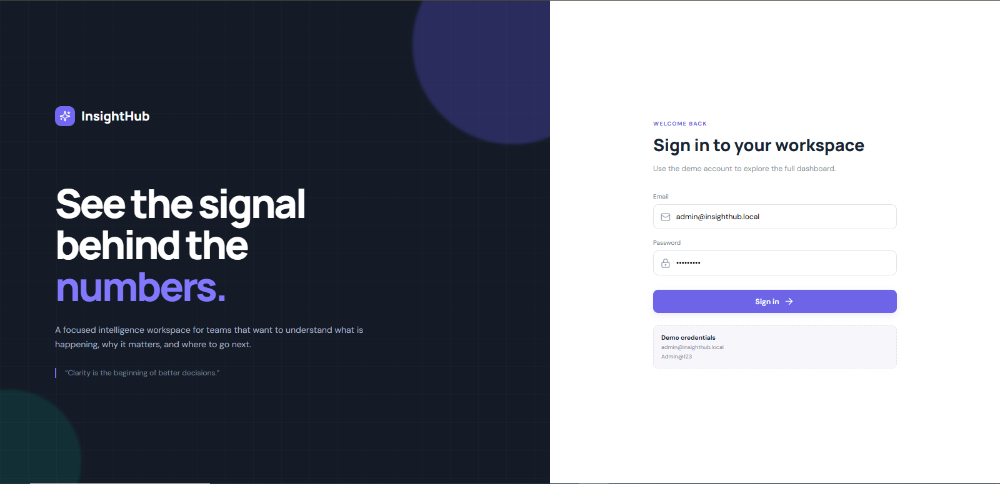

---

## 📊 Application Dashboard

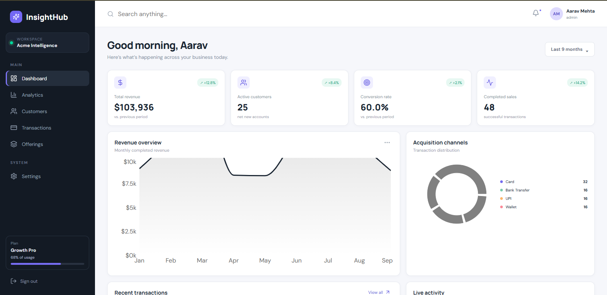

---

## 📈 Analytics Dashboard

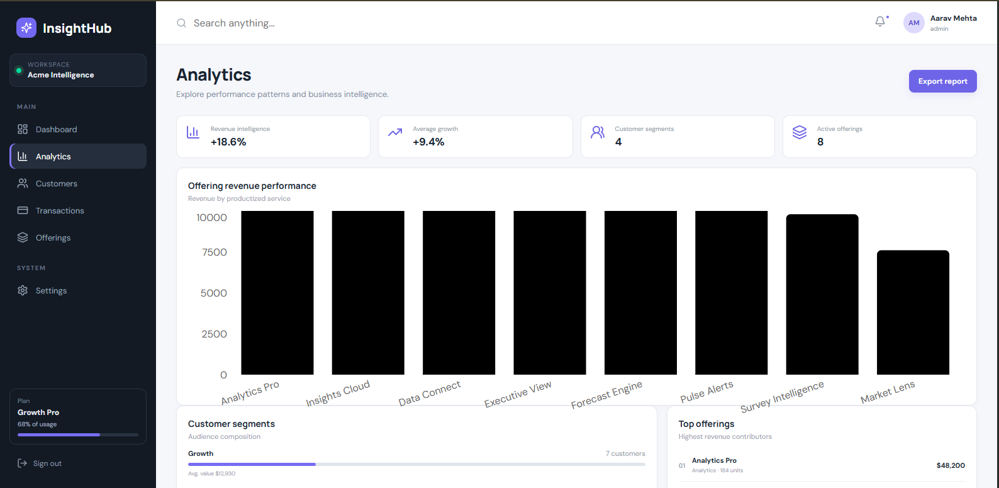

---

## 🔨 Jenkins Pipeline

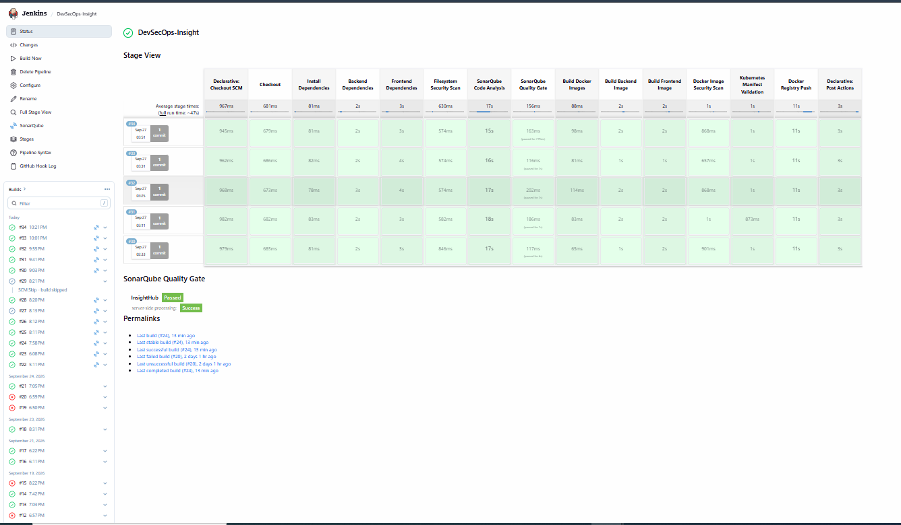

---

## 🔎 SonarQube Quality Gate

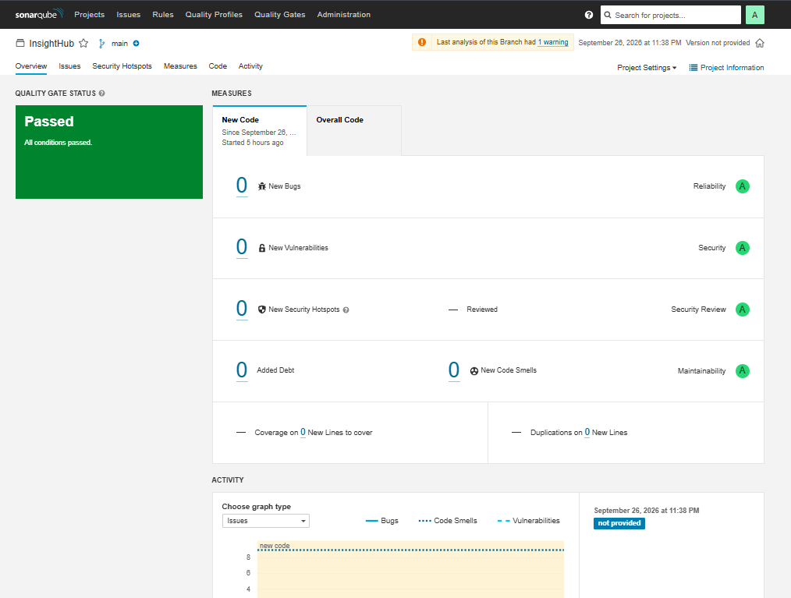

---

## 🛡️ Trivy Security Scan

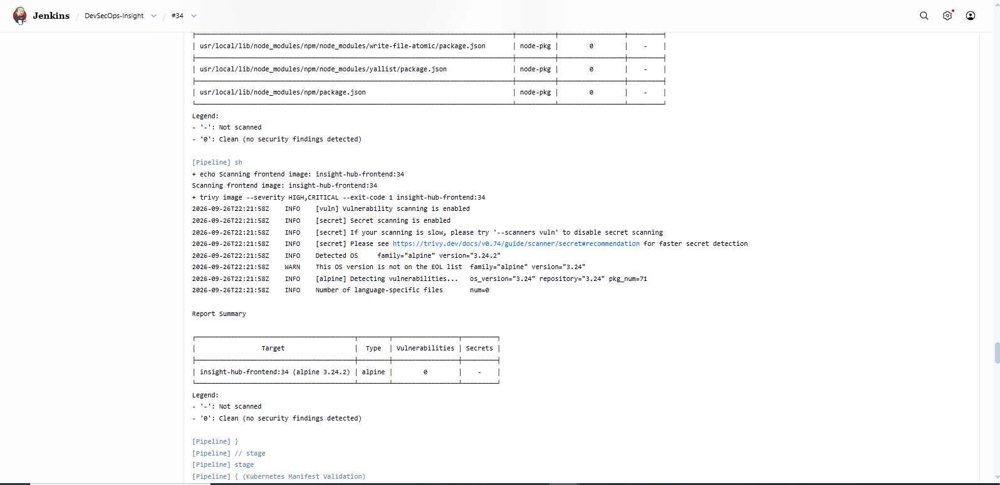

---

## 🐳 Docker Hub Images

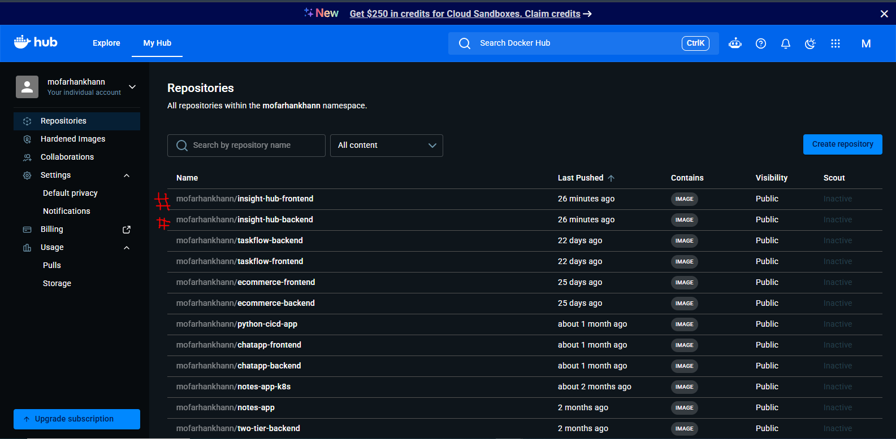

---

## 🚀 Argo CD Application

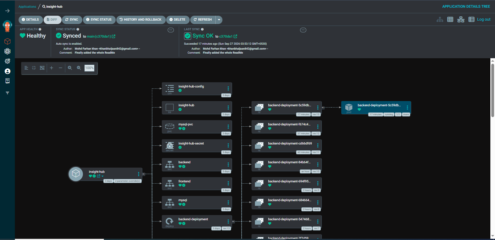

---

## 🤖 Argo CD Image Updater


---

## ☸️ Kubernetes Pods

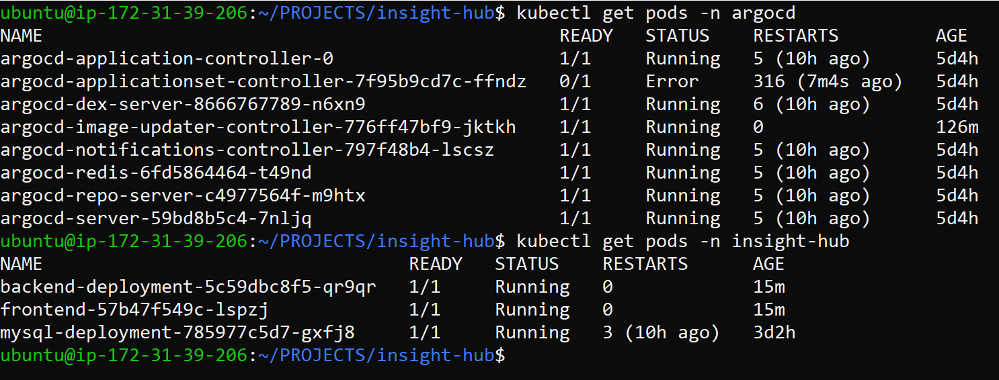

---

## 📡 Prometheus Targets

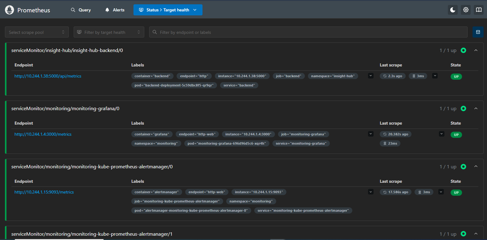

---

## 📊 Grafana Dashboard

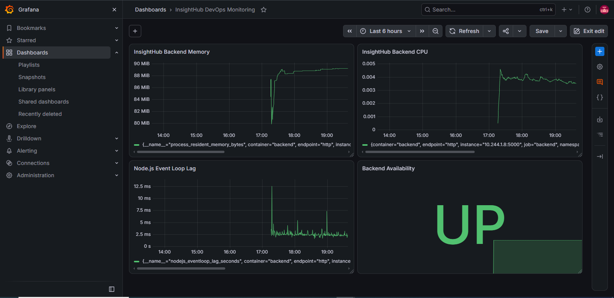

---

# 🧪 CI/CD Verification

The complete DevSecOps workflow was tested successfully.

```text
GitHub
   │
   ▼
GitHub Webhook
   │
   ▼
Jenkins
   │
   ├── Checkout
   │
   ├── Dependencies
   │
   ├── Trivy Filesystem Scan
   │
   ├── SonarQube Analysis
   │
   ├── Quality Gate
   │
   ├── Docker Build
   │
   ├── Trivy Image Scan
   │
   ├── Kubernetes Validation
   │
   └── Docker Hub Push
            │
            ▼
    Argo CD Image Updater
            │
            ▼
         Argo CD
            │
            ▼
       Kubernetes
            │
            ▼
        InsightHub
```

---

# ✅ Kubernetes Validation

Kubernetes manifests were validated using Kustomize and Kubeconform.

```text
Resources: 12

Valid:     12
Invalid:    0
Errors:     0
Skipped:    0
```

---

# ✅ Deployment Verification

The deployed application was verified with:

```text
Backend Pod
Frontend Pod
MySQL Pod
```

Application workloads reached:

```text
Running
```

Argo CD application status:

```text
Synced
Healthy
```

---

# 📚 DevOps Concepts Demonstrated

This project demonstrates practical knowledge of:

- Git
- GitHub
- GitHub Webhooks
- Jenkins
- CI/CD
- SonarQube
- Quality Gates
- Trivy
- Docker
- Docker Compose
- Docker Hub
- Kubernetes
- Deployments
- Services
- ConfigMaps
- Secrets
- PersistentVolumeClaims
- Ingress
- Kustomize
- Kubeconform
- Argo CD
- GitOps
- Argo CD Image Updater
- Prometheus
- Grafana
- ServiceMonitor
- AWS EC2
- AWS Security Groups
- JWT Authentication
- Container Security
- Application Monitoring

---

# 💡 Challenges Faced

During development and deployment, several practical issues were encountered and resolved.

### 🐳 Docker

- Container build issues
- Frontend API configuration
- Backend database connectivity
- Container networking
- Environment configuration
- Docker image management

### 🔨 Jenkins

- Pipeline configuration
- GitHub webhook integration
- SonarQube integration
- Quality Gate configuration
- Docker image build and push
- Pipeline troubleshooting

### 🔎 SonarQube

- Project configuration
- Scanner configuration
- Quality Gate integration
- Jenkins webhook configuration

### ☸️ Kubernetes

- Deployment configuration
- Service configuration
- MySQL deployment
- Persistent storage
- ConfigMap configuration
- Secret configuration
- Kustomize configuration
- Manifest validation
- Pod troubleshooting

### 🚀 Argo CD

- Application configuration
- Git repository integration
- Kubernetes synchronization
- Image update automation
- GitOps workflow

### 📊 Monitoring

- Prometheus configuration
- ServiceMonitor configuration
- Backend metrics endpoint
- Grafana monitoring setup

---

# 📚 Learning Outcomes

After completing this project, I gained practical experience in:

- Full-stack application development
- Docker containerization
- Docker Compose
- Jenkins CI
- SonarQube
- Quality Gates
- Trivy security scanning
- Docker Hub
- Kubernetes
- Kustomize
- Kubeconform
- Argo CD
- GitOps
- Argo CD Image Updater
- Prometheus
- Grafana
- AWS EC2
- AWS Security Groups
- JWT authentication
- Kubernetes Secrets
- Application monitoring
- Container troubleshooting
- Kubernetes troubleshooting
- CI/CD automation
- DevSecOps practices

---

# 🔮 Future Improvements

The following improvements can be added in future versions:

- 🏗️ Terraform Infrastructure as Code
- ☸️ Kubernetes High Availability
- 📈 Horizontal Pod Autoscaling
- 📊 Advanced Grafana Dashboards
- 🚨 Prometheus Alertmanager
- 📝 Centralized Logging with Loki
- 🔐 HTTPS / TLS
- 🔑 AWS Secrets Manager
- 🔏 Container Image Signing
- 👤 Advanced Kubernetes RBAC
- 🔄 Automated Rollback Strategies
- ☁️ Production-grade cloud architecture

---

# 📋 Complete DevSecOps Workflow

```text
                    ┌─────────────────┐
                    │    Developer    │
                    └────────┬────────┘
                             │
                             ▼
                    ┌─────────────────┐
                    │     GitHub      │
                    └────────┬────────┘
                             │
                         Webhook
                             │
                             ▼
                    ┌─────────────────┐
                    │     Jenkins     │
                    └────────┬────────┘
                             │
          ┌──────────────────┼──────────────────┐
          │                  │                  │
          ▼                  ▼                  ▼
       Trivy             SonarQube          Docker
       Scan              Quality Gate        Build
          │                  │                  │
          └──────────────────┼──────────────────┘
                             │
                             ▼
                    ┌─────────────────┐
                    │   Docker Hub    │
                    └────────┬────────┘
                             │
                             ▼
                ┌────────────────────────┐
                │ Argo CD Image Updater  │
                └────────────┬───────────┘
                             │
                             ▼
                    ┌─────────────────┐
                    │     Argo CD     │
                    └────────┬────────┘
                             │
                             ▼
                    ┌─────────────────┐
                    │   Kubernetes    │
                    │                 │
                    │ Frontend        │
                    │ Backend         │
                    │ MySQL           │
                    └────────┬────────┘
                             │
                   ┌─────────┴─────────┐
                   │                   │
                   ▼                   ▼
              Prometheus            Grafana
                   │                   │
                   └─────────┬─────────┘
                             ▼
                         Monitoring
```

---

# 🎯 Key DevOps Concepts

```text
GitHub
   ↓
GitHub Webhook
   ↓
Jenkins CI
   ↓
Trivy
   ↓
SonarQube
   ↓
Quality Gate
   ↓
Docker Build
   ↓
Trivy Image Scan
   ↓
Kubeconform
   ↓
Docker Hub
   ↓
Argo CD Image Updater
   ↓
Argo CD
   ↓
Kubernetes
   ↓
Prometheus
   ↓
Grafana
```

---

# 📦 Docker Images

| Image | Repository |
|---|---|
| Backend | `mofarhankhann/insight-hub-backend` |
| Frontend | `mofarhankhann/insight-hub-frontend` |

---

# 📁 Important Project Files

| File | Purpose |
|---|---|
| `Jenkinsfile` | Jenkins CI pipeline |
| `docker-compose.yml` | Local multi-container deployment |
| `sonar-project.properties` | SonarQube configuration |
| `k8s/kustomization.yaml` | Kubernetes resource management |
| `k8s/image-updater.yaml` | Argo CD Image Updater configuration |
| `k8s/monitoring/backend-servicemonitor.yaml` | Prometheus ServiceMonitor |
| `client/Dockerfile` | Frontend container image |
| `server/Dockerfile` | Backend container image |
| `client/nginx.conf` | Frontend Nginx configuration |

---

# 🏆 Project Highlights

```text
Application
    │
    ├── React
    ├── Node.js
    ├── Express
    └── MySQL

Containerization
    │
    ├── Docker
    └── Docker Compose

Continuous Integration
    │
    ├── Jenkins
    ├── SonarQube
    └── Trivy

Container Registry
    │
    └── Docker Hub

Continuous Delivery
    │
    ├── Argo CD
    └── Argo CD Image Updater

Orchestration
    │
    └── Kubernetes

Monitoring
    │
    ├── Prometheus
    └── Grafana

Cloud
    │
    └── AWS EC2
```

---

# 📌 Repository

<p align="center">

<a href="https://github.com/mofarhankhan/insight-hub">

</a>

</p>

**Repository:**  
https://github.com/mofarhankhan/insight-hub

---

# 👨‍💻 Author

## Mohd Farhan Khan

**DevOps / DevSecOps Enthusiast**

<p align="left">

<a href="https://github.com/mofarhankhan">

</a>

</p>

---

# ⭐ Support

If you found this project useful:

- ⭐ Star this repository
- 🍴 Fork it
- 🛠️ Explore the implementation
- 📢 Share it with others

---

## ❤️ Thank You

If you are exploring DevOps, DevSecOps, Kubernetes, CI/CD or GitOps, this project demonstrates how these technologies can be combined into a practical end-to-end workflow.
